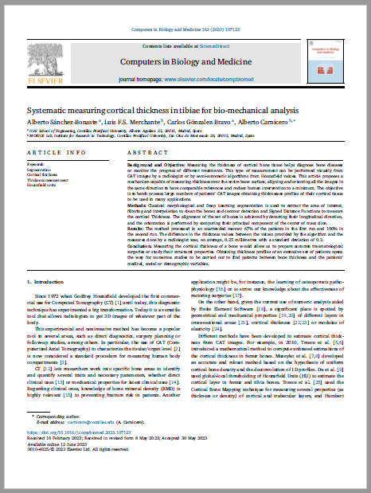

# Systematic measuring cortical thickness in tibiae for bio-mechanical analysis

This repository is associated to the article published by Alberto Sánchez-Bonaste, Luis F. S. Merchante, Carlos Gónzalez-Bravo and Alberto Carnicero

# Abstract:

Measuring the thickness of cortical bone tissue is crucial for diagnosing bone diseases and monitoring treatment progress. One can perform this measurement visually from CT images or using semi-automatic algorithms from Houndsfield values. This article proposes a mechanism capable of measuring thickness over the entire bone surface, aligning and orienting all images in the same direction to reduce human intervention. The objective is to batch process large numbers of patients' CAT images to obtain thickness profiles of their cortical tissue for various applications.

To achieve this, classical morphological and segmentation techniques are used to extract the area of interest, filter and interpolate the bones, and detect their contour and Signed Distance Functions to measure cortical thickness. The set of bones is aligned by detecting their longitudinal direction, and the orientation is determined by computing their principal component of the center of mass slice.

Measuring cortical thickness would enable accurate traumatological surgeries and the study of structural properties. Obtaining thickness profiles of a vast number of patients can open the door to various studies aimed at identifying patterns between bone thickness and patients' medical, social, or demographic variables.

  

# Data:

In the DATA folder, there are two sets of CT images used in the article to evaluate the performance of the code provided in this repository. The rest of the images cannot be shared due to confidentiality reasons. If any researcher is interested in replicating the article's results with the same dataset, they can proceed after signing the appropriate confidentiality agreements with the authors of the paper.

# Parameters description:

All the configuration is centralized in the file.ini in the "config" folder. That file is organized in sections:

#### dicom
This section configures all the paths:

- data_path_dicom. Folder with the CT images sets
- output_path. Folder to store STL files
- resources_path. Temporary folder to assist Visual Logging

#### pre-process

- spacing. Milimeters per slice and milimeters per pixel. Used to sample all the datasets at the same resolution. Default value: [0.5,0.25,0.25]
- threshold. Segmentation parameter. Set to 50 to extract the whole leg. To extract isolated bones, use higher values around 210, but it is more instable. It can be modified but first execution is recommended to be left to 50.
- extract. List of segmented elements IDs to extract. If empty, it extracts the largest element. In our case, the tibiae. 
- size. Main erosion and dilation kernel size. With spacing [0.5, 0.25, 0.25] it is set to 60. When the X and Y sampling rate is different, kernel size is updated authomatically. It can be provided but first execution is recommended not to be toched. If a different value is provided it will override the automated kernel size.
- kernel_preerosion. Smoothing and hole filling operators. It can be modified but first execution is recommended to be left to [1,1]
- kernel_firstdilation. Smoothing and hole filling operators. It can be modified but first execution is recommended to be left to [7,7]
- kernel_firsterosion. Smoothing and hole filling operators. It can be modified but first execution is recommended to be left to [6,6]

#### post-process

- threshold_between_min. Lower bound of the HU units to be filtered. It can be modified but first execution is recommended to be left to 250 for cortical detection
- threshold_between_max. Upper bound of the HU units to be filtered. It rarely needs to be modified from 2000
- convert_stl. Boolean variable that indicates if STL needs to be generated or not.

#### thickness

- num_views_thickness. If 1D thickness permiter profiles are desired, this variables set the number of those profiles. The main profile is captured in the Center of Mass, and the rest are extracted equidistantly from it.

#### all dicom

- reference_bone. It the CT bones are desired to be aligned and oriented against a reference bone, this variable sets the PATH to its DICOM files

#### reference vectors

- orientation_vector. Those parameters are filled out after the execution of the script referencBone.py. Only two coordinates (X and Y) are required. User doesn't need to provide a value
- alignment_vector . Those parameters are filled out after the execution of the script referencBone.py. Three spacial coordinates are required (X,Y,Z). For instance [0,0,1] to be aligned against the Z axis. User doesn't need to provide a value

#### retake

- legX. the same name of the stl file of which you want to perfrom the retake. Two boolean values required. 0: no correction. 1: yes correction. First value is for change leg (right leg and you need it to be left or vice versa) and the second for correct the direction (pca pointing to contrary direction). For example, if the bone 4 belongs to the opposite leg than the reference one but the PCA component is okey, the structure will be: leg4 = 1,0

# Api Reference

A description of the implemented methods can be found in README file from "docs" folder. 

# User guide:

A user guide can be found in USERGuide file from "docs" folder. 

# Replication:

To replicate the results provided in the article, run those steps:

1. Clone repository
2. Use this values in the configuration file:

		[dicom]
		data_path_dicom = C:/corticalMeasurement/data/
		output_path = C:/corticalMeasurement/output/
		resources_path = C:/corticalMeasurement/resources/

		[pre-process]
		spacing = [0.5,0.25,0.25]
		threshold = 50
		extract = []
		size = 60
		kernel_preerosion = [1,1]
		kernel_firstdilation = [7,7]
		kernel_firsterosion = [6,6]

		[post-process]
		threshold_between_min = 250
		threshold_between_max = 2000
		convert_stl = True

		[thickness]
		num_views_thickness = 9

		[all dicom]
		reference_bone = C:/corticalMeasurement/data/TAC A

		[reference vectors]
		orientation_vector = 
		alignment_vector = 

3. Download from data section both TACS, TAC A and TAC B, and insert both on the route established in data_path_dicom 
4. Run PYTHON code:
5. Review LOG file

# Dependences:
See requirements.txt for tested library versions

### Visual logging dependences:
pip install visual-logging
pip install vg
