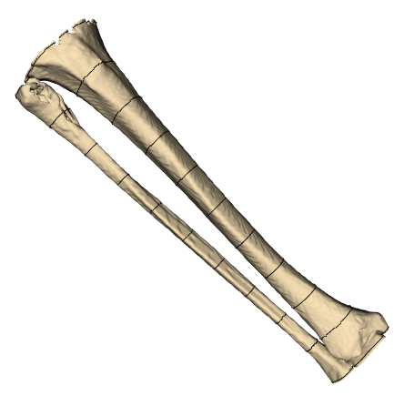
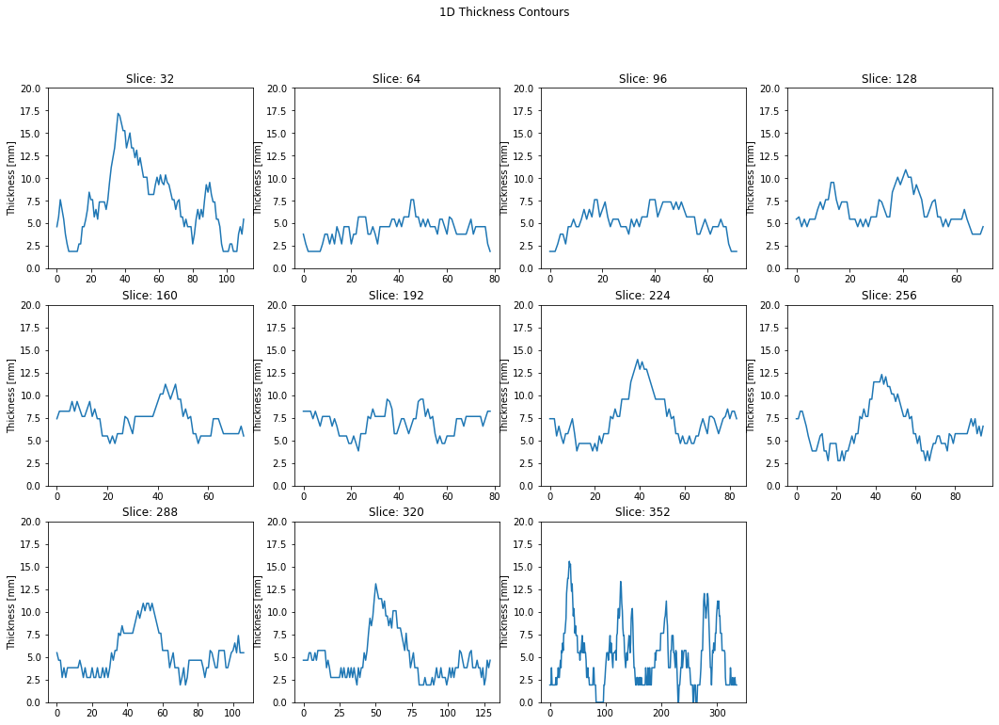
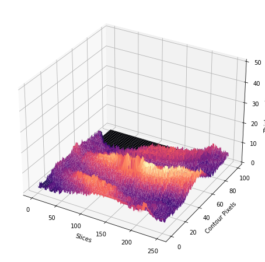
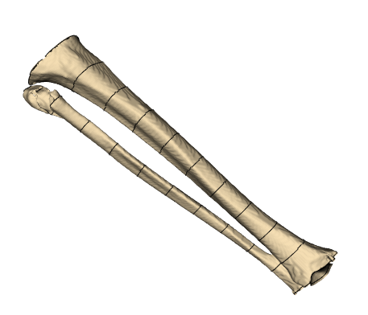
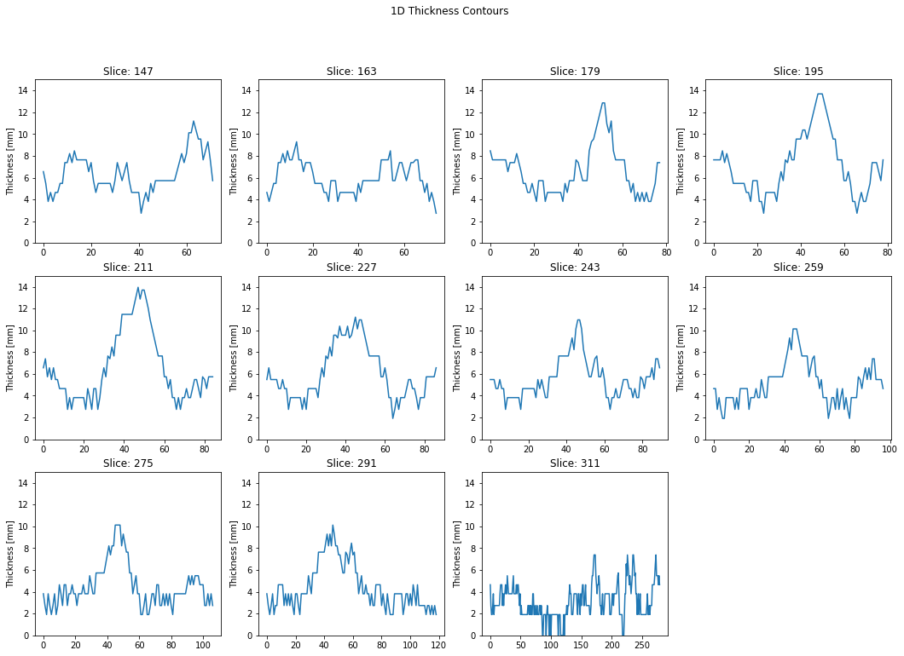
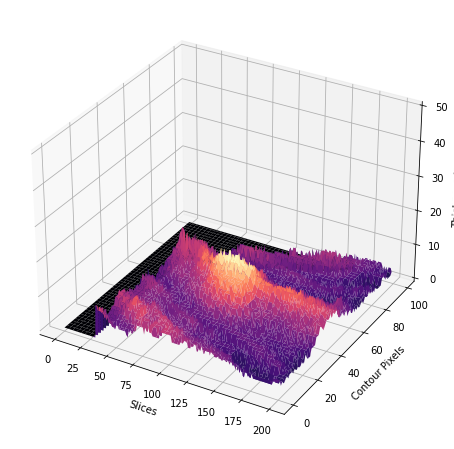

# DATA

If any researcher is interested in replicating the article's results with the same dataset, they can proceed after signing the appropriate confidentiality agreements with the authors of the paper.

## Tac A

Chosing 11 profiles equally distributed:

  

#### Perimetric Thickness profiles:

  

#### Un-wrapped thickness surface:

  

#### Un-wrapped thickness surface:

  

## Tac B

Chosing 11 profiles equally distributed:

  

#### Perimetric Thickness profiles:

  

#### Un-wrapped thickness surface:

  

#### Un-wrapped thickness surface:

  

