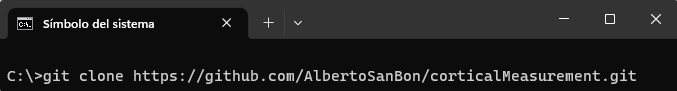
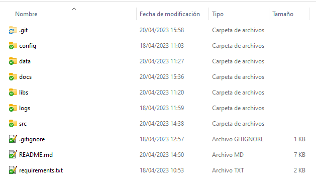

# User Guide

**DISCLAIMER**. The code provided in this repository is only intended to share the results of the article it refers to. The code is not optimised for efficient use. There are multiple blocks that have been implemented in a simple way for ease of debugging, but not for runtime optimisation.

### 1. Clone repository:

  

### 2. Understand repo folders:

The repository is structured in 6 folders:

* config - contains configuration file
* data - contains two datasets to test the code
* docs - contains this guide and the API reference
* libs - contain the library required for the code to run
* logs - folder that will store the application traces
* src - folde that contains the python scripts

  

### 3. Setup configuration file:

Before starting, write in config/file.ini the following parameters. Visite the entry [README](../README.md) file for details of each parameter:

		[dicom]
		data_path_dicom = C:/corticalMeasurement/data/
		output_path = C:/corticalMeasurement/output/
		resources_path = C:/corticalMeasurement/resources/

		[pre-process]
		spacing = [0.5,0.25,0.25]
		threshold = 50
		extract = []
		size = 60
		kernel_preerosion = [1,1]
		kernel_firstdilation = [7,7]
		kernel_firsterosion = [6,6]

		[post-process]
		threshold_between_min = 250
		threshold_between_max = 2000
		convert_stl = True

		[thickness]
		num_views_thickness = 9

		[all dicom]
		reference_bone = C:/corticalMeasurement/data/TAC A

		[reference vectors]
		orientation_vector = 
		alignment_vector = 
		
		[retake]

**IMPORTANT**. The spacing identifies the resampling of the input images. If after a first iteration a new one needs to be done to improve results of some bones, spacing should not be changed. 

1. Script: generateSTls.py --> Generate STL models from DICOM files.
	After the execution is finished, we will have in the directory set in output_path the STL models named as legX.stl.
	Establish the reference STL model in file.ini.

2. Script: referenceBone.py --> Generates reference vectors for future corrections and reference bone thickness profiles. 
	When the execution ends, the orientation and alignment reference vectors that will be used in future corrections appear in the file.ini.
	In addition, a log file (html) will be generated with the results of thickness for the reference bone.

3. Script: correctionsThickness.py --> Performs orientation and alignment corrections and generates thickness profiles.
	When the execution ends, a log file (html) will be generated. In this file the corrections and thickness profiles are represented by bone.

To continue, you have to review this log file bone by bone. Only if the bone in the orientation correction looks like it belongs to the opposite leg to the reference one, the change_leg parameter must be set to 1 or/and if the PCA component is towards the back of the bone, the parameter Correct_direction_manually must be set to 1.

These values must be written in file file.ini in section [retake] with the following structure: legX = value_change_leg, value_Correct_direction_manually.

Example --> if the bone 4 belongs to the opposite leg to the reference one but the PCA component is okey, the structure will be: leg4 = 1,0

4. Script: cT_Retake.py --> Performs re-orientation and re-alignment corrections and re-generates thickness profiles in selected bones.

# Recommendations

* Make first run of the whole process at low resolution, for example:

	spacing = [1,1,1]
	
  This setting will improve dramatically the execution time. 
 
 * 

# API Reference

The document linked [here](API-Reference.md) describe the implemented methods, and their parameters.

